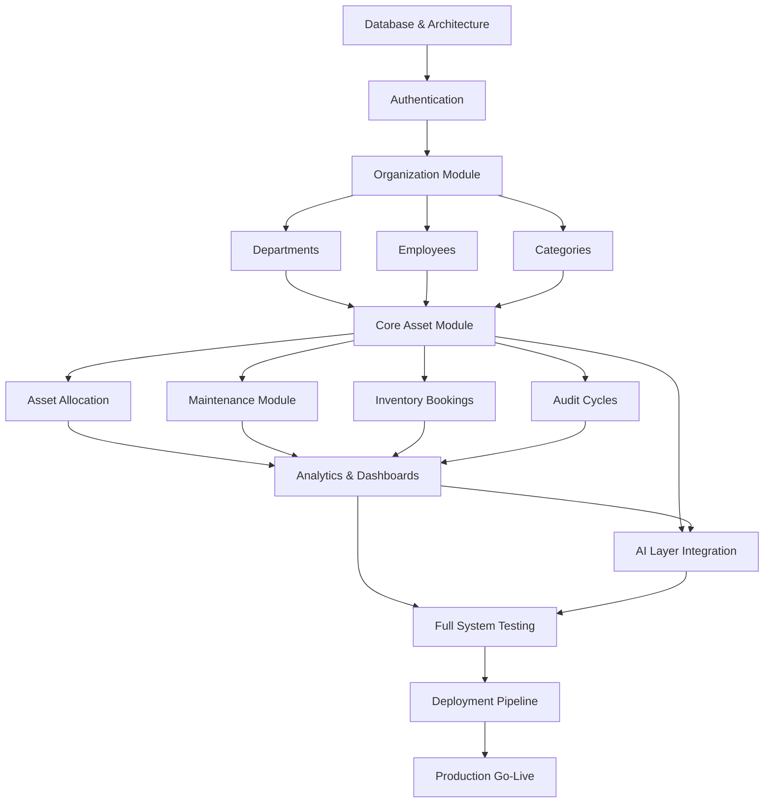

# Module Dependency Graph

This document illustrates the dependencies between modules in AssetFlow AI. Lower-level modules must be completed before higher-level modules can be implemented.

## High-Level Dependency Graph

## Description of Key Paths

1. **The Critical Path**: `Database -> Auth -> Org (Depts/Employees/Categories) -> Assets`. This is the fundamental data backbone of the application. An asset cannot exist without a category and a department. It cannot be allocated without an employee.
2. **Post-Asset Workflows**: Once `Assets` exist, `Allocations`, `Maintenance`, `Bookings`, and `Audits` can be developed in parallel as they all depend primarily on the core asset entity.
3. **Data Consumers**: `Analytics` and `AI` sit on top of the workflow modules because they require data (both schema and actual records) to visualize insights or generate meaningful AI responses.
4. **Delivery**: Testing, Deployment, and Go-Live strictly follow feature completion.
