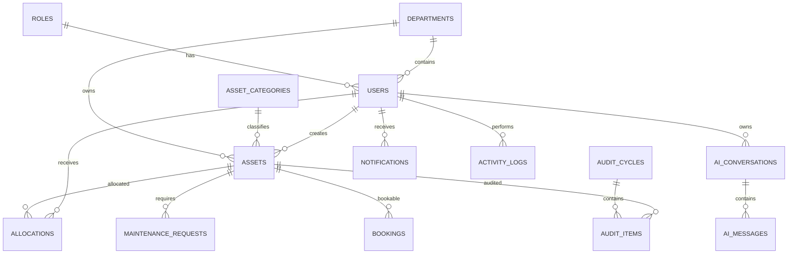

# Section 6.2 — Entity Relationship Diagram (ERD) & Relationship Architecture

---

# Purpose

This section defines the logical data model for AssetFlow AI.

The ERD represents how every business entity is connected, ensuring:

- Data integrity
- Referential consistency
- Scalable architecture
- Predictable relationships
- Efficient querying
- Minimal redundancy

The ERD is the single source of truth for database relationships.

---

# High-Level Architecture

```

                     Organization
                          │
      ┌───────────────────┼───────────────────┐
      │                   │                   │
      ▼                   ▼                   ▼
 Departments         Asset Categories      Users
      │                   │                   │
      │                   │                   │
      └──────────────┬────┘                   │
                     ▼                        │
                  Assets ◄────────────────────┘
                     │
     ┌───────────────┼────────────────┐
     │               │                │
     ▼               ▼                ▼
 Allocations     Maintenance      Bookings
     │               │                │
     ▼               ▼                ▼
Transfers      Maintenance Logs   Resources

                     │
                     ▼
                  Audit Items
                     │
                     ▼
                 Audit Cycles

                     │
                     ▼
               Activity Logs

                     │
                     ▼
               Notifications

                     │
                     ▼
                AI Conversations
```

---

# Database Domains

The platform is divided into logical domains.

```
Authentication
Organization
Assets
Operations
Communication
Analytics
AI
Configuration
```

Each domain owns its entities.

---

# Domain 1 — Authentication

Tables

```
users
roles
permissions
role_permissions
sessions
```

Relationships

```
Role

↓

Users

↓

Sessions
```

Cardinality

```
One Role

↓

Many Users

One User

↓

Many Sessions

One Role

↓

Many Permissions
```

---

# Domain 2 — Organization

Tables

```
departments

asset_categories

locations
```

Relationships

```
Department

↓

Employees

↓

Assets
```

Department

↓

One Department Head

↓

Many Employees

---

# Domain 3 — Assets

Tables

```
assets

asset_documents

asset_images

asset_history

asset_qr_codes

asset_status_history
```

Relationship

```
Asset

↓

Many Documents

Many Images

Many Status Changes

Many Allocations

Many Maintenance Records

Many Audit Records
```

Cardinality

```
One Asset

↓

Many History Records

One Asset

↓

Many Maintenance Requests

One Asset

↓

Many Audit Results
```

---

# Domain 4 — Operations

Tables

```
allocations

transfers

bookings

resources

maintenance_requests

maintenance_logs
```

Relationship

```
Asset

↓

Allocation

↓

Transfer

↓

Return
```

Booking

↓

Resource

↓

Calendar

---

# Domain 5 — Audit

Tables

```
audit_cycles

audit_items

audit_reports
```

Relationship

```
Audit Cycle

↓

Many Audit Items

↓

One Asset

↓

One Auditor
```

---

# Domain 6 — Reports

Tables

```
reports

dashboard_cache

analytics_snapshots
```

Purpose

Stores generated reports and analytics cache.

---

# Domain 7 — Communication

Tables

```
notifications

emails

activity_logs
```

Relationships

```
User

↓

Notifications

↓

Activity Logs
```

---

# Domain 8 — AI

Tables

```
ai_conversations

ai_messages

ai_feedback
```

Relationship

```
User

↓

Conversation

↓

Messages
```

---

# Domain 9 — Configuration

Tables

```
settings

feature_flags

system_config
```

---

# Complete Entity List

Authentication

- Users
- Roles
- Permissions
- Sessions

Organization

- Departments
- Categories
- Locations

Assets

- Assets
- Asset Documents
- Asset Images
- Asset QR Codes
- Asset History
- Asset Status History

Operations

- Allocations
- Transfers
- Bookings
- Resources
- Maintenance Requests
- Maintenance Logs

Audit

- Audit Cycles
- Audit Items
- Audit Reports

Communication

- Notifications
- Emails
- Activity Logs

Analytics

- Reports
- Dashboard Cache
- Analytics Snapshots

AI

- AI Conversations
- AI Messages
- AI Feedback

Configuration

- Settings
- Feature Flags
- System Config

---

# Relationship Matrix

## User

Relationships

```
User

1 → Many Assets Created

1 → Many Allocations

1 → Many Transfers

1 → Many Bookings

1 → Many Maintenance Requests

1 → Many Notifications

1 → Many Activity Logs

1 → Many AI Conversations
```

---

## Department

Relationships

```
Department

1 → Many Users

1 → Many Assets

1 → Many Reports
```

---

## Category

Relationships

```
Category

1 → Many Assets
```

---

## Asset

Relationships

```
Asset

1 → Many Allocations

1 → Many Transfers

1 → Many Maintenance Requests

1 → Many Audit Items

1 → Many Documents

1 → Many Images

1 → Many Status Records
```

---

## Allocation

Relationships

```
Allocation

Belongs To

User

Asset

Department
```

---

## Booking

Relationships

```
Booking

Belongs To

Resource

User
```

---

## Maintenance

Relationships

```
Maintenance

Belongs To

Asset

Technician

Requester
```

---

## Audit

Relationships

```
Audit Cycle

↓

Audit Item

↓

Asset
```

---

# Cardinality Summary

Users

```
Role

1

↓

Many Users
```

Departments

```
Department

1

↓

Many Employees
```

Assets

```
Department

1

↓

Many Assets
```

Categories

```
Category

1

↓

Many Assets
```

Allocations

```
Asset

1

↓

Many Allocations
```

Maintenance

```
Asset

1

↓

Many Requests
```

Bookings

```
Resource

1

↓

Many Bookings
```

Audit

```
Audit Cycle

1

↓

Many Audit Items
```

Notifications

```
User

1

↓

Many Notifications
```

---

# Delete Strategy

Some entities should never be physically deleted.

Instead use Soft Delete.

| Entity | Strategy |
|---------|----------|
| Users | Soft Delete |
| Departments | Soft Delete |
| Assets | Soft Delete |
| Bookings | Soft Delete |
| Maintenance | Never Delete |
| Audit | Never Delete |
| Activity Logs | Never Delete |
| Notifications | Archive |

---

# Cascade Rules

Department

↓

Assets

RESTRICT

---

Category

↓

Assets

RESTRICT

---

Asset

↓

Maintenance

RESTRICT

---

Asset

↓

Allocation History

RESTRICT

---

User

↓

Notifications

SET NULL

---

User

↓

Activity Logs

SET NULL

---

# Future Relationship Extensions

The schema should allow adding:

```

Inventory

Procurement

Purchase Orders

Vendors

Invoices

Warranty

RFID

IoT Devices

GPS Tracking

Mobile Sync

Digital Twin

Predictive AI

Knowledge Base
```

without modifying existing relationships.

---

# Mermaid ER Diagram (Conceptual)



---

# Database Growth Estimate

| Table | Estimated Records |
|--------|------------------:|
| Users | 100,000 |
| Departments | 10,000 |
| Assets | 5,000,000 |
| Asset History | 100,000,000 |
| Allocations | 50,000,000 |
| Bookings | 20,000,000 |
| Maintenance | 30,000,000 |
| Notifications | 100,000,000 |
| Activity Logs | 500,000,000 |

The schema should remain performant through proper indexing, partitioning (where needed), and optimized query design.

---

# Section Summary

This section defines the logical relationship architecture of AssetFlow AI. Every entity, relationship, cardinality, cascade rule, and domain boundary is specified here, providing the blueprint for the PostgreSQL schema, Drizzle ORM models, and backend service layer.

The next section (**6.3**) will translate this conceptual model into concrete table definitions, beginning with the core tables:

- Users
- Roles
- Permissions
- Departments
- Asset Categories
- Locations

Each table will include:

- Complete column definitions
- Data types
- Constraints
- Indexes
- Default values
- Foreign keys
- Business rules
- Validation rules
- Example records
- Drizzle ORM mapping guidance
